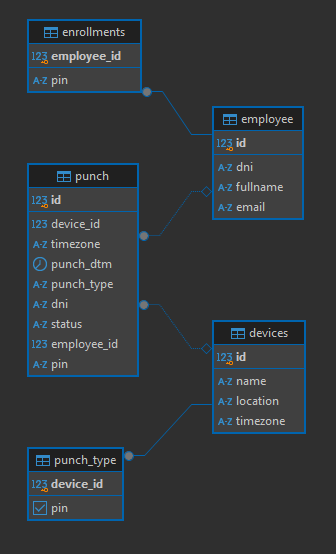

# FastAPI Backend QA Challenge

# Resumen
El proyecto permite Administrar Dispositivos, Empleados y además permite realizar marcajes con PIN

Consta de los siguientes objetos

- dispositivos (devices)
- empleados (employee)
- enrolamiento (enrolls)
- marcas (punch)
- tipo de marca (punch_type)

# Flujo

El flujo general del sistema es:

- El administrador del sistema, puede agregar dispositivos y empleados
- Un dispositivo es un lugar donde el empleado realizar marcas
    - Una marca, es cuando un empleado indica cuando entra o sale del trabajo
    - una marca se puede realizar de diversas formas, con tarjetas, biometrica, pin, etc, en este caso, solo será con pin.
- A los dispositivos se le indica que tipo de marca puede realizar, con el campo ``pin`` en True o False, y se guarda en tabla punch_type.
- Un empleado puede enrolarse indicando un pin númerico.
    - Enrolar, se refiere a establecer una forma para marcar para ese empleado
- Despues el empleado puede marcar con PIN, validando:
    - que el empleado está enrolado con pin
    - que el pin de la marca sea el mismo que con el se enroló
    - que el dispositivo donde marcará permita marcar con pin
- Finalmente, el administrador podrá ver las marcas realizadas por los empleados
    - permitinedo poder filtrar por distintos campos de la tabla punch

# Modelo BD



# Requisitos

- Python mayor a 3.10
- BD Postgress

# Docker

Se puede construir y ejecutar con el siguiente comando

```sh
docker compose -f docker-compose.yml up --build -d
```
